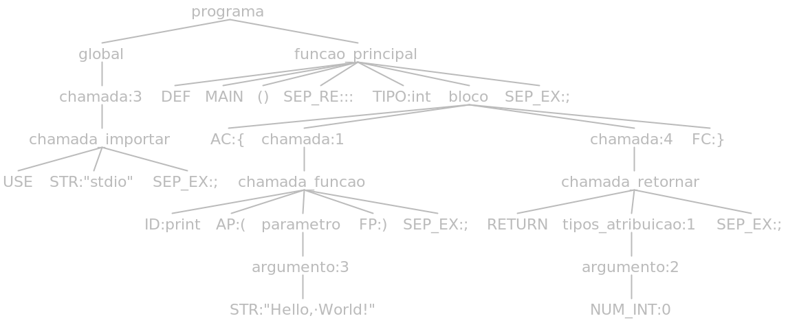
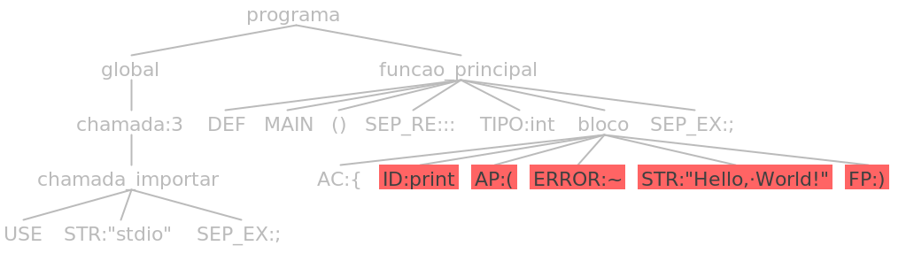
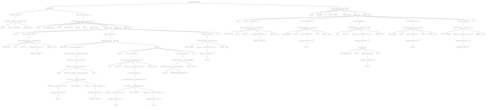
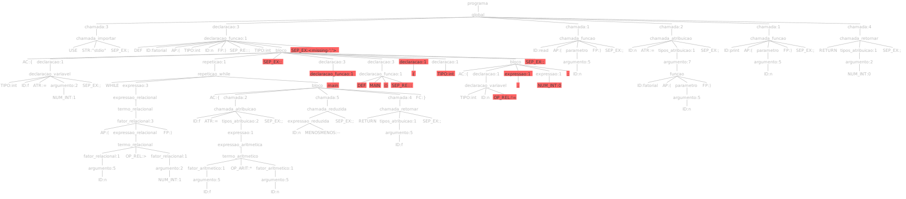

# 
   Departamento de Ciência da Computação  GCC130 - Compiladores - 2022/2  Prof. Dr. Maurício Ronny De Almeida Souza  

 Henrique Curi de Miranda - 202020087
 
 João Gabriel Kondarzewski Zanella - 202020091
 
 Nathan Felipe de Assis - 202020774
 
 Victor Gonçalves Lima - 202020775

# 
 Linguagem C Mais ou Menos - **C** **P**lus **M**inus (**CPM**)

# Conteúdo

- [1. Visão Geral](#1-visão-geral)
  - [1.1. hello\_world.cpm](#11-hello_worldcpm)
  - [1.2. plus\_minus.cpm](#12-plus_minuscpm)
  - [1.3. fatorial.cpm](#13-fatorialcpm)
- [2. Definição Léxica](#2-definição-léxica)
- [3. Definição Sintática](#3-definição-sintática)
  - [3.1. Estrutura](#31-estrutura)
  - [3.2. Auxiliares](#32-auxiliares)
  - [3.3. Expressões](#33-expressões)
  - [3.4. Declarações](#34-declarações)
  - [3.5. Repetições](#35-repetições)
  - [3.6. Condicionais](#36-condicionais)
  - [3.7. Chamadas](#37-chamadas)
  - [3.8. Outros](#38-outros)
- [4. Definição Semântica](#4-definição-semântica)
- [5 Casos de Teste](#5-casos-de-teste)
  - [5.1 Erros léxicos](#51-erros-léxicos)
    - [hello\_world.cpm](#hello_worldcpm)
    - [fatorial.cpm](#fatorialcpm)
  - [5.2 Erros sintáticos](#52-erros-sintáticos)
    - [hello\_world.cpm](#hello_worldcpm-1)
    - [fatorial.cpm](#fatorialcpm-1)
  - [5.3 Erros semânticos](#53-erros-semânticos)
    - [soma.cpm](#somacpm)
    - [fatorial.cpm](#fatorialcpm-2)
- [6. Detalhes da Implementação](#6-detalhes-da-implementação)
  - [6.1. Algoritmos de exemplo](#61-algoritmos-de-exemplo)
    - [6.1.1 hello\_world.cpm](#611-hello_worldcpm)
    - [6.1.2. plus\_minus.cpm](#612-plus_minuscpm)
    - [6.1.3. fatorial.cpm](#613-fatorialcpm)
    - [6.1.4. conversor\_temeperatura.cpm](#614-conversor_temeperaturacpm)
    - [6.1.5. media\_aritmetica.cpm](#615-media_aritmeticacpm)
    - [6.1.6. soma\_naturais.cpm](#616-soma_naturaiscpm)
    - [6.1.7. distancia\_pontos.cpm](#617-distancia_pontoscpm)
    - [6.1.8. maximo.cpm](#618-maximocpm)
    - [6.1.9. soma.cpm](#619-somacpm)
    - [6.1.10. area\_circulo.cpm](#6110-area_circulocpm)
  - [6.2. Definições Léxicas e Sintáticas](#62-definições-léxicas-e-sintáticas)
  - [6.3 Analisador Léxico](#63-analisador-léxico)
  - [6.4. Analisador Sintático](#64-analisador-sintático)
  - [6.5. Analisador Semântico](#65-analisador-semântico)
  - [6.6 Arquivos gerados pelo ANTLR e criados](#66-arquivos-gerados-pelo-antlr-e-criados)
- [7. Repositório no GitHub](#7-repositório-no-github)

# 1. Visão Geral

A linguagem de programação projetada foi nomeada C+- ("C Mais ou Menos"). Seu nome pode ser lido de várias maneiras, como "C Mais ou Menos", "C Plus Minus" ou simplesmente "CPM", igual a extensão de código fonte da linguagem (".cpm"). O C+- é uma linguagem inspirada em C, C++ e Python, apresentando sintax simples, mas fortemente tipada. O objeto da linguagem é ser didática e minimalista, assim, não é orienda a objetos e possui tipos primitivos bem definidos. Abaixo temos alguns exemplos de códigos escritos com a linguagem.

## 1.1. hello_world.cpm

    use "stdio";

    def main() :: int {
        print("Hello, World!");
        return 0;
    };

## 1.2. plus_minus.cpm

    use "stdio";

    def main() :: int {
        int c = 0;
        read(c);
        c+-;
        print(c);
        return 0;
    };

## 1.3. fatorial.cpm

    use "stdio";

    def fatorial(int n) :: int {
        int f = 1;
        while (n > 1) {
            f = f * n;
            n--;
        }
        return f;
    };

    def main() :: int {
        int n = 0;
        read(n);
        n = fatorial(n);
        print(n);
        return 0;
    };

# 2. Definição Léxica

A tabela abaixo apresenta uma lista completa dos elementos que compõem a definição léxica da linguagem C+-, incluindo estruturas de controle, operadores aritméticos, relacionais e lógicos, tipos primitivos, delimitadores e identificadores de variáveis e funções. A tabela também inclui especificações para comentários, definição da função principal, definição de funções, retorno de valor por função, estruturas condicionais e de repetição, separadores de tipo da função e linha de expressão, atribuição de valor à variável, incrementadores e decrementadores, números inteiros e reais, e cadeias de caracteres. Esses padrões de uso fornecem as regras fundamentais para que um programa seja escrito em C+-.

Classe | Sigla | Padrão
-------|-------|-------
Comentário | COMMENT | Cadeia de caracteres iniciadas com "/*" e terminadas com "*/"
Tipos primitivos | TIPO | "int", "float", "void", "double", "str", "bool" |
Identificação da função principal | MAIN | "main"
Definir funções | DEF | "def"
Retorno de valor por função | RETURN | "return"
Estrutura condicional "se" | IF | "if"
Estrutura condicional "se não se" | IFSE | "ifse"
Estrutura condicional "se não" | ELSE | "else"
Estrutura de repetição "enquanto" | WHILE | "while"
Estrutura de repetição "para" | FOR | "for"
Separador de tipo da função | SEP_RE: "::"
Separador de linha de expressão | SEP_EX | ";"
Abre chave | AC | "{"
Fecha chave | FC | "}"
Abre parêntese | AP | "("
Fecha parêntese | FP | ")"
Abre colchete | ACOL | "["
Fecha colchete | FCOL | "]"
Identificador de variáveis e funções | ID | Cadeia de caracteres incluindo dígitos, letras maiúsculas, letras minúsculas e sublinhado, devendo começar com sublinhado ou letra minúscula.
Atribuiçao de valor à variável | ATR | "="
Incrementador de mais menos | MAISMENOS | "+-"
Incrementador | MAISMAIS | "++"
Decrementador | MENOSMENOS | "--"
Operadores aritméticos | OP_ARIT | "+" ou "-" ou "*" ou "/" ou "%"
Operadores relacionais | OP_REL | "<" ou ">" ou "<=" ou ">=" ou "==" ou "!="
Operadores lógicos | OP_LOG | "and" ou "or" ou "not"
Números inteiros | NUM_INT | Sequência de dígitos que, opcionalmente, iniciar ou com um símbolo negativo ou um símbolo positivo
Números reais | NUM_FLOAT | Sequência de dígitos que, opcionalmente, iniciar ou com um símbolo negativo ou um símbolo positivo seguidas de um ponto e outra sequência de dígitos
Cadeias de caracteres (strings) | STR | Cadeia de caracteres delimitados por aspas duplas

# 3. Definição Sintática

A definição sintática de uma linguagem é definida por sua Grmática Livre de Contexto (GLC). Uma GLC é uma quádrupla (N, T, P, S), onde:

- N é um conjunto finito de símbolos não-terminais (variáveis);

- T é um conjunto finito de símbolos terminais (tokens);

- P é um conjunto finito de regras de produção que definem como as variáveis podem ser substituídas por sequências de símbolos terminais e não-terminais;

- S é o símbolo inicial (uma variável distinta de N) que é usado como ponto de partida para gerar todas as sentenças da linguagem.

Abaixo estão as regras da GLC da linguagem C+-,  divididas em grupos.

## 3.1. Estrutura

    programa → global funcao_principal?

    funcao_principal -> DEF MAIN '()' '::' TIPO bloco ';'

    global -> (bloco | expressao | declaracao | repeticao | condicional | chamada)*

    bloco -> '{' (bloco | vetor | funcao | expressao | declaracao | repeticao | condicional | chamada)* '}'

## 3.2. Auxiliares

    argumento -> NUM_FLOAT | NUM_INT | STR | BOOL | ID | vetor | funcao

    tipos_atribuicao -> argumento | expressao

    parametro -> ((argumento | expressao) (',' (argumento | expressao)) *)

    indice -> NUM_INT | ID | vetor | funcao | expressao

    termo_aritmetico -> fator_aritmetico (OP_ARIT fator_aritmetico)*

    fator_aritmetico -> argumento | '(' expressao_aritmetica ')'

    termo_logico -> fator_logico (OP_LOG fator_logico)*

    fator_logico -> ID | vetor | BOOL | '(' expressao_logica ')'

    termo_relacional -> fator_relacional (OP_REL fator_relacional)*

## 3.3. Expressões

    expressao -> expressao_aritmetica | expressao_logica | expressao_relacional | expressao_reduzida

    expressao_reduzida -> ID (MENOSMENOS | MAISMAIS | MAISMENOS)

    expressao_aritmetica -> termo_aritmetico ((OP_ARIT (termo_aritmetico | termo_relacional)))*

    expressao_logica -> termo_logico (OP_LOG (termo_logico | termo_relacional))*

    expressao_relacional -> termo_relacional (OP_REL (termo_relacional | termo_logico))*

## 3.4. Declarações

    declaracao -> declaracao_variavel | declaracao_vetor | declaracao_funcao

    declaracao_variavel -> TIPO ID ('=' (argumento | expressao))? ';'

    declaracao_vetor -> TIPO '[' (NUM_INT | ID | vetor) ']' ID ('=' '{' parametro? '}')? ';'

    declaracao_funcao -> DEF ID '(' (TIPO ID (',' TIPO ID)*) ')' '::' TIPO  bloco? ';' | DEF ID '()' '::' TIPO  bloco? ';'

## 3.5. Repetições

    repeticao -> repeticao_while | repeticao_for

    repeticao_while -> WHILE expressao bloco

    repeticao_for -> FOR '(' declaracao_variavel expressao ';' expressao_reduzida ')' bloco

## 3.6. Condicionais

    condicional -> condicional_if | condcional_ifse | condicional_else

    condicional_if -> IF expressao bloco

    condcional_ifse -> IFSE expressao bloco

    condicional_else -> ELSE bloco

## 3.7. Chamadas

    chamada -> chamada_funcao | chamada_atribuicao | chamada_importar | chamada_retornar | chamada_reduzida

    chamada_reduzida -> expressao_reduzida ';'

    chamada_funcao -> ID '(' parametro? ')'  ';'

    chamada_atribuicao -> (ID | vetor) '=' tipos_atribuicao ';'

    chamada_importar -> USE STR ';'

    chamada_retornar -> RETURN tipos_atribuicao ';'

## 3.8. Outros

    vetor -> ID '[' indice ']'

    funcao -> ID '(' parametro? ')'

# 4. Definição Semântica

Foi implementado as seguintes regras semânticas para o C+-:

- Checagem de variáveis não declaradas

- Checagem de declarações duplicadas de variáveis

- Checagem de escopo de variáveis (parcialmente)

E ficou para ainda ser implementado:

- Checagem de tipo

# 5 Casos de Teste

## 5.1 Erros léxicos

### hello_world.cpm

- Sem erro:

        use "stdio";

        def main() :: int {
            print("Hello, World!");
            return 0;
        };

    O código sem nenhum erro gera a seguinte saída de tokens pelo nosso Analisador Léxico:

        Lexema: use
            Classe: 'use'
            Linha:  1
        Lexema: "stdio"
            Classe: STR
            Linha:  1
        Lexema: ;
            Classe: ';'
            Linha:  1
        Lexema: def
            Classe: 'def'
            Linha:  3
        Lexema: main
            Classe: 'main'
            Linha:  3
        Lexema: ()
            Classe: '()'
            Linha:  3
        Lexema: ::
            Classe: '::'
            Linha:  3
        Lexema: int
            Classe: TIPO
            Linha:  3
        Lexema: {
            Classe: '{'
            Linha:  3
        Lexema: print
            Classe: ID
            Linha:  4
        Lexema: (
            Classe: '('
            Linha:  4
        Lexema: "Hello, World!"
            Classe: STR
            Linha:  4
        Lexema: )
            Classe: ')'
            Linha:  4
        Lexema: ;
            Classe: ';'
            Linha:  4
        Lexema: return
            Classe: 'return'
            Linha:  5
        Lexema: 0
            Classe: NUM_INT
            Linha:  5
        Lexema: ;
            Classe: ';'
            Linha:  5
        Lexema: }
            Classe: '}'
            Linha:  6
        Lexema: ;
            Classe: ';'
            Linha:  6

- Com erro:

        use "stdio";

        def main() :: int {
            print(~"Hello, World!");
            returm 0;
        }

    O código com um erro léxico pela presença de um lexema não identificável “~”, gera a seguinte saída de tokens pelo nosso Analisador Léxico:

        Lexema: use
            Classe: 'use'
            Linha:  1
        Lexema: "stdio"
            Classe: STR
            Linha:  1
        Lexema: ;
            Classe: ';'
            Linha:  1
        Lexema: def
            Classe: 'def'
            Linha:  3
        Lexema: main
            Classe: 'main'
            Linha:  3
        Lexema: ()
            Classe: '()'
            Linha:  3
        Lexema: ::
            Classe: '::'
            Linha:  3
        Lexema: int
            Classe: TIPO
            Linha:  3
        Lexema: {
            Classe: '{'
            Linha:  3
        Lexema: print
            Classe: ID
            Linha:  4
        Lexema: (
            Classe: '('
            Linha:  4

        ==========================================
        Lexema invalido identificado!
            Lexema: ~
            Linha:  4
            Inicio: 44
            Fim:    44
        ==========================================

        Lexema: "Hello, World!"
            Classe: STR
            Linha:  4
        Lexema: )
            Classe: ')'
            Linha:  4
        Lexema: ;
            Classe: ';'
            Linha:  4
        Lexema: returm
            Classe: ID
            Linha:  5
        Lexema: 0
            Classe: NUM_INT
            Linha:  5
        Lexema: ;
            Classe: ';'
            Linha:  5
        Lexema: }
            Classe: '}'
            Linha:  6

### fatorial.cpm

- Sem erro:

        use "stdio";

        def fatorial(int n) :: int {
            int f = 1;
            while (n > 1) {
                f = f * n;
                n--;
            }
            return f;
        };

        def main() :: int {
            int n = 0;
            read(n);
            n = fatorial(n);
            print(n);
            return 0;
        };

    O código sem nenhum erro gera a seguinte saída de tokens pelo nosso Analisador Léxico:

        Lexema: use
            Classe: 'use'
            Linha:  1
        Lexema: "stdio"
            Classe: STR
            Linha:  1
        Lexema: ;
            Classe: ';'
            Linha:  1
        Lexema: def
            Classe: 'def'
            Linha:  3
        Lexema: fatorial
            Classe: ID
            Linha:  3
        Lexema: (
            Classe: '('
            Linha:  3
        Lexema: int
            Classe: TIPO
            Linha:  3
        Lexema: n
            Classe: ID
            Linha:  3
        Lexema: )
            Classe: ')'
            Linha:  3
        Lexema: ::
            Classe: '::'
            Linha:  3
        Lexema: int
            Classe: TIPO
            Linha:  3
        Lexema: {
            Classe: '{'
            Linha:  3
        Lexema: int
            Classe: TIPO
            Linha:  4
        Lexema: f
            Classe: ID
            Linha:  4
        Lexema: =
            Classe: '='
            Linha:  4
        Lexema: 1
            Classe: NUM_INT
            Linha:  4
        Lexema: ;
            Classe: ';'
            Linha:  4
        Lexema: while
            Classe: 'while'
            Linha:  5
        Lexema: (
            Classe: '('
            Linha:  5
        Lexema: n
            Classe: ID
            Linha:  5
        Lexema: >
            Classe: OP_REL
            Linha:  5
        Lexema: 1
            Classe: NUM_INT
            Linha:  5
        Lexema: )
            Classe: ')'
            Linha:  5
        Lexema: {
            Classe: '{'
            Linha:  5
        Lexema: f
            Classe: ID
            Linha:  6
        Lexema: =
            Classe: '='
            Linha:  6
        Lexema: f
            Classe: ID
            Linha:  6
        Lexema: *
            Classe: OP_ARIT
            Linha:  6
        Lexema: n
            Classe: ID
            Linha:  6
        Lexema: ;
            Classe: ';'
            Linha:  6
        Lexema: n
            Classe: ID
            Linha:  7
        Lexema: --
            Classe: '--'
            Linha:  7
        Lexema: ;
            Classe: ';'
            Linha:  7
        Lexema: }
            Classe: '}'
            Linha:  8
        Lexema: return
            Classe: 'return'
            Linha:  9
        Lexema: f
            Classe: ID
            Linha:  9
        Lexema: ;
            Classe: ';'
            Linha:  9
        Lexema: }
            Classe: '}'
            Linha:  10
        Lexema: ;
            Classe: ';'
            Linha:  10
        Lexema: def
            Classe: 'def'
            Linha:  12
        Lexema: main
            Classe: 'main'
            Linha:  12
        Lexema: ()
            Classe: '()'
            Linha:  12
        Lexema: ::
            Classe: '::'
            Linha:  12
        Lexema: int
            Classe: TIPO
            Linha:  12
        Lexema: {
            Classe: '{'
            Linha:  12
        Lexema: int
            Classe: TIPO
            Linha:  13
        Lexema: n
            Classe: ID
            Linha:  13
        Lexema: =
            Classe: '='
            Linha:  13
        Lexema: 0
            Classe: NUM_INT
            Linha:  13
        Lexema: ;
            Classe: ';'
            Linha:  13
        Lexema: read
            Classe: ID
            Linha:  14
        Lexema: (
            Classe: '('
            Linha:  14
        Lexema: n
            Classe: ID
            Linha:  14
        Lexema: )
            Classe: ')'
            Linha:  14
        Lexema: ;
            Classe: ';'
            Linha:  14
        Lexema: n
            Classe: ID
            Linha:  15
        Lexema: =
            Classe: '='
            Linha:  15
        Lexema: fatorial
            Classe: ID
            Linha:  15
        Lexema: (
            Classe: '('
            Linha:  15
        Lexema: n
            Classe: ID
            Linha:  15
        Lexema: )
            Classe: ')'
            Linha:  15
        Lexema: ;
            Classe: ';'
            Linha:  15
        Lexema: print
            Classe: ID
            Linha:  16
        Lexema: (
            Classe: '('
            Linha:  16
        Lexema: n
            Classe: ID
            Linha:  16
        Lexema: )
            Classe: ')'
            Linha:  16
        Lexema: ;
            Classe: ';'
            Linha:  16
        Lexema: return
            Classe: 'return'
            Linha:  17
        Lexema: 0
            Classe: NUM_INT
            Linha:  17
        Lexema: ;
            Classe: ';'
            Linha:  17
        Lexema: }
            Classe: '}'
            Linha:  18
        Lexema: ;
            Classe: ';'
            Linha:  18

- Com erro:

        use "stdio";

        def fatorial(int n) :: int {
            int f = 1;
            while (n ? 1) {
                f = f * n;
                n--;
            }
            return f;
        };

        def main() :: int {
            int n = 0;
            read(&n);
            n = fatorial(n);
            print(n);
            return 0;
        };

    O código com dois erros léxicos pela presença de dois lexemas não identificáveis: “?” e "&", gera a seguinte saída de tokens pelo nosso Analisador Léxico:

        Lexema: use
            Classe: 'use'
            Linha:  1
        Lexema: "stdio"
            Classe: STR
            Linha:  1
        Lexema: ;
            Classe: ';'
            Linha:  1
        Lexema: def
            Classe: 'def'
            Linha:  3
        Lexema: fatorial
            Classe: ID
            Linha:  3
        Lexema: (
            Classe: '('
            Linha:  3
        Lexema: int
            Classe: TIPO
            Linha:  3
        Lexema: n
            Classe: ID
            Linha:  3
        Lexema: )
            Classe: ')'
            Linha:  3
        Lexema: ::
            Classe: '::'
            Linha:  3
        Lexema: int
            Classe: TIPO
            Linha:  3
        Lexema: {
            Classe: '{'
            Linha:  3
        Lexema: int
            Classe: TIPO
            Linha:  4
        Lexema: f
            Classe: ID
            Linha:  4
        Lexema: =
            Classe: '='
            Linha:  4
        Lexema: 1
            Classe: NUM_INT
            Linha:  4
        Lexema: ;
            Classe: ';'
            Linha:  4
        Lexema: while
            Classe: 'while'
            Linha:  5
        Lexema: (
            Classe: '('
            Linha:  5
        Lexema: n
            Classe: ID
            Linha:  5

        ==========================================
        Lexema invalido identificado!
            Lexema: ?
            Linha:  5
            Inicio: 71
            Fim:    71
        ==========================================

        Lexema: 1
            Classe: NUM_INT
            Linha:  5
        Lexema: )
            Classe: ')'
            Linha:  5
        Lexema: {
            Classe: '{'
            Linha:  5
        Lexema: f
            Classe: ID
            Linha:  6
        Lexema: =
            Classe: '='
            Linha:  6
        Lexema: f
            Classe: ID
            Linha:  6
        Lexema: *
            Classe: OP_ARIT
            Linha:  6
        Lexema: n
            Classe: ID
            Linha:  6
        Lexema: ;
            Classe: ';'
            Linha:  6
        Lexema: n
            Classe: ID
            Linha:  7
        Lexema: --
            Classe: '--'
            Linha:  7
        Lexema: ;
            Classe: ';'
            Linha:  7
        Lexema: }
            Classe: '}'
            Linha:  8
        Lexema: return
            Classe: 'return'
            Linha:  9
        Lexema: f
            Classe: ID
            Linha:  9
        Lexema: ;
            Classe: ';'
            Linha:  9
        Lexema: }
            Classe: '}'
            Linha:  10
        Lexema: ;
            Classe: ';'
            Linha:  10
        Lexema: def
            Classe: 'def'
            Linha:  12
        Lexema: main
            Classe: 'main'
            Linha:  12
        Lexema: ()
            Classe: '()'
            Linha:  12
        Lexema: ::
            Classe: '::'
            Linha:  12
        Lexema: int
            Classe: TIPO
            Linha:  12
        Lexema: {
            Classe: '{'
            Linha:  12
        Lexema: int
            Classe: TIPO
            Linha:  13
        Lexema: n
            Classe: ID
            Linha:  13
        Lexema: =
            Classe: '='
            Linha:  13
        Lexema: 0
            Classe: NUM_INT
            Linha:  13
        Lexema: ;
            Classe: ';'
            Linha:  13
        Lexema: read
            Classe: ID
            Linha:  14
        Lexema: (
            Classe: '('
            Linha:  14

        ==========================================
        Lexema invalido identificado!
            Lexema: &
            Linha:  14
            Inicio: 178
            Fim:    178
        ==========================================

        Lexema: n
            Classe: ID
            Linha:  14
        Lexema: )
            Classe: ')'
            Linha:  14
        Lexema: ;
            Classe: ';'
            Linha:  14
        Lexema: n
            Classe: ID
            Linha:  15
        Lexema: =
            Classe: '='
            Linha:  15
        Lexema: fatorial
            Classe: ID
            Linha:  15
        Lexema: (
            Classe: '('
            Linha:  15
        Lexema: n
            Classe: ID
            Linha:  15
        Lexema: )
            Classe: ')'
            Linha:  15
        Lexema: ;
            Classe: ';'
            Linha:  15
        Lexema: print
            Classe: ID
            Linha:  16
        Lexema: (
            Classe: '('
            Linha:  16
        Lexema: n
            Classe: ID
            Linha:  16
        Lexema: )
            Classe: ')'
            Linha:  16
        Lexema: ;
            Classe: ';'
            Linha:  16
        Lexema: return
            Classe: 'return'
            Linha:  17
        Lexema: 0
            Classe: NUM_INT
            Linha:  17
        Lexema: ;
            Classe: ';'
            Linha:  17
        Lexema: }
            Classe: '}'
            Linha:  18
        Lexema: ;
            Classe: ';'
            Linha:  18

## 5.2 Erros sintáticos

A etapa final do trabalho foi a implementação do Analisador Sintático, que também alertará sobre erros léxicos e sintáticos.

### hello_world.cpm

- Sem erro:

        use "stdio";

        def main() :: int {
            print("Hello, World!");
            return 0;
        };

    O código sem nenhum erro gera a seguinte árvore:

    

- Com erro:

        use "stdio";

        def main() :: int {
            print(~"Hello, World!");
            returm 0;
        }

    O código com um erro sintático ao escrever "returm" onde deveria ser "return" gera a seguinte árvore:

    

### fatorial.cpm

- Sem erro:

        use "stdio";

        def fatorial(int n) :: int {
            int f = 1;
            while (n > 1) {
                f = f * n;
                n--;
            }
            return f;
        };

        def main() :: int {
            int n = 0;
            read(n);
            n = fatorial(n);
            print(n);
            return 0;
        };

    O código sem nenhum erro sintático gera a seguinte árvore:

    

- Com erro:

        use "stdio";

        def fatorial(int n) :: int {
            int f = 1;
            while (n > 1) {
                f = f * n;
                n--;
            return f;
        };

        def main() :: int {
            int n != 0;
            read(n);
            n = fatorial(n);
            print(n);
            return 0;
        };

    O código com dois erros sintáticos ao não fechar as chaves "}" do while e atribuir um valor com "!=", gera a seguinte árvore:

    

## 5.3 Erros semânticos

### soma.cpm

- Sem erro:

    def main() :: int {
        int a = 10;
        int b = 20;
        int s = 0;
        s = a + b;
        return 0;
    };

    Ao passar o código pelo Analisador Semântica, nenhum erro será notificado.

- Com erro:

        def main() :: int {
            int a = 10;
            b = 20;
            int s = 0;
            s = a + b;
            return 0;
        };

    Ao executar o código, um erro semântico é alertado pois a variável b não foi declarada antes de ser atribuida um valor.

        Variável 'b' não foi declarada mas foi usada na linha 5

### fatorial.cpm

- Sem erro:

        use "stdio";

        def fatorial(int n) :: int {
            int f = 1;
            while (n > 1) {
                f = f * n;
                n--;
            }
            return f;
        };

        def main() :: int {
            int n = 0;
            read(n);
            n = fatorial(n);
            print(n);
            return 0;
        };

Ao passar o código pelo Analisador Semântica, nenhum erro será notificado.

- Com erro:

        use "stdio";

        def fatorial(int n) :: int {
            int f = 1;
            while (n > 1) {
                f = f * n;
                n--;
            return f;
        };

        def main() :: int {
            int n = 0;
            read(n);
            n = fatorial(n);
            print(n);
            return 0;
        };

    O código ao passar pelo analisador semântico irá alertar sobre a variável `n` não ter sido declarada, mesmo sendo declarada nos argumentos, isto deverá ser corrigido. A falta de um fecha chaves leva a um erro sintático, o caracter `&` leva a um erro léxico. Além disso, como não foi implementado as funções uma forma de chamar funções externas de outro arquivo como `stdio`, as funções `print` e `read` são alertadas como não declaradas, gerando erro semântico.

        line 9:1 extraneous input ';' expecting {'use', TIPO, BOOL, 'def', 'return', 'if', 'ifse', 'else', 'while', 'for', '{', '}', '(', NUM_INT, NUM_FLOAT, STR, ID}
        Variável 'n' não foi declarada mas foi usada na linha 5
        Variável 'n' não foi declarada mas foi usada na linha 6
        Função 'read' não foi declarada mas foi usada na linha 13
        Função 'print' não foi declarada mas foi usada na linha 16

    

# 6. Detalhes da Implementação

## 6.1. Algoritmos de exemplo

A equipe criou códigos de exemplo da língugem que deram uma base forte para iniciar suas definições formais. Todos são individuais e
demonstram alguma característica diferente dos outros.

### 6.1.1 hello_world.cpm

    use "stdio";

    def main() :: int {
        print("Hello, World!");
        return 0;
    };

### 6.1.2. plus_minus.cpm

    use "stdio";

    def main() :: int {
        int c = 0;
        read(c);
        c+-;
        print(c);
        return 0;
    };

### 6.1.3. fatorial.cpm

    use "stdio";

    def fatorial(int n) :: int {
        int f = 1;
        while (n > 1) {
            f = f * n;
            n--;
        }
        return f;
    };

    def main() :: int {
        int n = 0;
        read(n);
        n = fatorial(n);
        print(n);
        return 0;
    };

### 6.1.4. conversor_temeperatura.cpm

    use "stdio";

    def Celsius_para_Fahrenheit(float c) :: float {
        float f = (9.0 * c / 5.0) + 32.0;
        return f;
    };

    def main() :: int {

        float c = 0.0;
        read(c);

        float f = 0;
        f = Celsius_para_Fahrenheit(c);
        print(f);

        return 0;
    };

### 6.1.5. media_aritmetica.cpm

    use "stdio";

    def media_aritmetica(int a, int b, int c) :: float {
        float media = (a + b + c) / 3.0;
        return media;
    };

    def main() :: int {

        int a = 0, b = 0, c = 0;
        read(a);
        read(b);
        read(c);

        float media = 0.0;
        media = media_aritmetica(a, b, c);
        print(media);

        return 0;
    };

### 6.1.6. soma_naturais.cpm

    use "stdio";

    def soma_naturais(int n) :: int {
        int soma = 0;
        int i = 1;
        while (i <= n) {
            soma = soma + i;
            i++;
        }
        return soma;
    };

    def main() :: int {
        int n = 0;
        read(n);
        int soma = 0;
        soma = soma_naturais(n);
        print(soma);
        return 0;
    };

### 6.1.7. distancia_pontos.cpm

    use "stdio";

    def distancia_pontos(float x1, float y1, float x2, float y2) :: float {
        float dx = x2 - x1;
        float dy = y2 - y1;
        float distancia = sqrt(dx*dx + dy*dy);
        return distancia;
    };

    def main() :: int {
        float x1 = 0, y1 = 0, x2 = 0, y2 = 0;
        read(x1);
        read(y1);
        read(x2);
        read(y2);

        float distancia = 0.0;
        distancia = distancia_pontos(x1, y1, x2, y2);
        print(distancia);

        return 0;
    };

### 6.1.8. maximo.cpm

    use "stdio";

    def maximo(int a, int b) :: int {
        if (a > b) {
            return a;
        } else {
            return b;
        }
    };

    def main() :: int {
        int a = 0, b = 0;
        read(a);
        read(b);

        int max = 0;
        max = maximo(a, b);
        print(max);

        return 0;
    };

### 6.1.9. soma.cpm

    def soma(int x, int y) :: int {
        int z = 0;
        z = x + y;
        return z;
    };

    def main() :: int {
        int a = 10;
        int b = 20;
        int s = 0;
        s = soma(a, b);
        return 0;
    };

### 6.1.10. area_circulo.cpm

    use "stdio";

    def area_circulo(float raio) :: float {
        float area = 3.14159 * raio * raio;
        return area;
    };

    def main() :: int {
        float raio = 0.0;
        read(raio);

        float area = 0.0;
        area = area_circulo(raio);
        print(area);

        return 0;

    };

## 6.2. Definições Léxicas e Sintáticas

Foram criadas as definições léxicas e sintáticas da linguagem C+-, especificando quais palavras pertenciam a linguagem e em quais classes, e as regras de sua GLC. Abaixo está o código fonte do arquivo `cpm.g4`do **ANTLR** para as definições léxicas, sintáticas. Com base nele, executamos o arquivo binário do **ANTLR** para gerar os códigos fontes.

`cpm.g4`

    grammar cpm;

    @header {
        package antlr;
    }

    /*
    -------------------------------------------- LEXER RULES ------------------------------------------------
    ----------------------------------------------------------------------------------------------------------
    ----------------------------------------------------------------------------------------------------------
    ----------------------------------------------------------------------------------------------------------
    ----------------------------------------------------------------------------------------------------------
    ----------------------------------------------------------------------------------------------------------
    */

    fragment LETRA: [a-zA-Z];
    fragment DIGITO: [0-9];

    // Incluir bibliotecas
    USE: 'use' ;

    // Comentário
    COMMENT: '/*' .* '*/' ;

    // Tipos primitivos
    TIPO: 'int' | 'float' | 'void' | 'double' | 'str' | 'bool';

    // Booleanos
    BOOL: 'true' | 'false' ;

    // Definir funções
    DEF: 'def' ;

    // Função principal
    MAIN: 'main' ;

    // Retorno de valor por função
    RETURN: 'return' ;

    // Estruturas condicionais
    IF: 'if' ;
    IFSE: 'ifse' ;
    ELSE: 'else' ;

    // Estruturas de repetição
    WHILE: 'while' ;
    FOR: 'for' ;

    // Separadores
    SEP_RE: '::' ;
    SEP_EX: ';' ;

    // Delimitadores
    AC: '{' ;
    FC: '}' ;
    AP: '(' ;
    FP: ')' ;
    ACOL : '[' ;
    FCOL : ']' ;

    // Operadores lógicos
    OP_LOG: 'and' | 'or' | 'not' ;

    // Atribuição
    ATR: '=' ;

    // Operadores aritméticos
    MAISMENOS: '+-' ;
    MAISMAIS: '++' ;
    MENOSMENOS: '--' ;
    OP_ARIT: '+' | '-' | '*' | '/' | '%' ;

    // Operadores relacionais
    OP_REL: '<' | '<=' | '>=' | '>' | '==' | '!=' ;

    // Números
    NUM_INT: ('-' | '+')?DIGITO+ ;
    NUM_FLOAT: ('-' | '+')?DIGITO+('.'DIGITO+) ;

    // Strings
    STR: '"' ('\\' ["\\] | ~["\\\r\n])* '"' ;

    // Nome de variáveis e funções
    ID: (LETRA | '_')(DIGITO | LETRA | '_')* ;

    // Caracteres inúteis
    WS: [ \r\t\n]* -> skip ;

    // Erro
    ERROR: . ;

    /*
    -------------------------------------------- PARSER RULES -----------------------------------------------
    ----------------------------------------------------------------------------------------------------------
    ----------------------------------------------------------------------------------------------------------
    ----------------------------------------------------------------------------------------------------------
    ----------------------------------------------------------------------------------------------------------
    ----------------------------------------------------------------------------------------------------------
    */

    /*
    -------------------------------------------- Estrutura --------------------------------------------------
    ----------------------------------------------------------------------------------------------------------
    */

    // Estrutura padrão de um programa cpm
    programa:
        global funcao_principal?
        ;

    funcao_principal:
        DEF MAIN '()' '::' TIPO bloco ';'
        ;

    global:
        (
        bloco
        | expressao
        | declaracao
        | repeticao
        | condicional
        | chamada
        )*
        ;

    // Um bloco é tudo aquilo em que é necessário {}
    bloco:
    '{'
    (
        bloco
        | vetor
        | funcao
        | expressao
        | declaracao
        | repeticao
        | condicional
        | chamada
    )*
    '}'
    ;

    /*
    -------------------------------------------- Auxiliares -------------------------------------------------
    ----------------------------------------------------------------------------------------------------------
    */

    // Necessário para não causar recursão à esquerda nas expressões
    // Mudar nome

    argumento:
        NUM_FLOAT
        | NUM_INT
        | STR
        | BOOL
        | ID
        | vetor
        | funcao
        ;

    tipos_atribuicao:
        argumento
        | expressao
        ;

    parametro:
        ((argumento | expressao) (',' (argumento | expressao))*)
        ;

    indice:
        (NUM_INT | ID | vetor | funcao | expressao)
        ;

    termo_aritmetico:
        fator_aritmetico (OP_ARIT fator_aritmetico)*
        ;

    fator_aritmetico:
        argumento | '(' expressao_aritmetica ')'
        ;

    termo_logico:
        fator_logico (OP_LOG fator_logico)*
        ;

    fator_logico:
        ID | vetor | BOOL | '(' expressao_logica ')'
        ;

    termo_relacional:
        fator_relacional (OP_REL fator_relacional)*
        ;

    fator_relacional:
        argumento  | BOOL | '(' expressao_relacional ')'
        ;

    /*
    -------------------------------------------- Expressões -------------------------------------------------
    ----------------------------------------------------------------------------------------------------------
    */

    expressao:
        expressao_aritmetica
        | expressao_logica
        | expressao_relacional
        | expressao_reduzida
        ;

    expressao_reduzida:
        ID (MENOSMENOS | MAISMAIS | MAISMENOS)
        ;

    expressao_aritmetica:
        termo_aritmetico ((OP_ARIT (termo_aritmetico | termo_relacional)))*
        ;

    expressao_logica:
        termo_logico (OP_LOG (termo_logico | termo_relacional))*
        ;

    expressao_relacional:
        termo_relacional (OP_REL (termo_relacional | termo_logico))*
        ;

    /*
    -------------------------------------------- Declarações ------------------------------------------------
    ----------------------------------------------------------------------------------------------------------
    */

    declaracao:
        declaracao_variavel
        | declaracao_vetor
        | declaracao_funcao
        ;

    declaracao_variavel:
        TIPO ID ('=' (argumento | expressao))? ';'
        ;

    declaracao_vetor:
        TIPO '[' (NUM_INT | ID | vetor) ']' ID ('=' '{' parametro? '}')? ';'
        ;

    declaracao_funcao:
        DEF ID '(' (TIPO ID (',' TIPO ID)*) ')' '::' TIPO  bloco? ';'
        | DEF ID '()' '::' TIPO  bloco? ';'
        ;

    /*
    -------------------------------------------- Repetições -------------------------------------------------
    ----------------------------------------------------------------------------------------------------------
    */

    repeticao:
        repeticao_while
        | repeticao_for
        ;

    repeticao_while:
        WHILE expressao bloco
        ;

    repeticao_for:
        FOR '(' declaracao_variavel expressao ';' expressao_reduzida ')' bloco
        ;

    /*
    -------------------------------------------- Condicionais -----------------------------------------------
    ----------------------------------------------------------------------------------------------------------
    */

    condicional:
        condicional_if
        | condcional_ifse
        | condicional_else
        ;

    condicional_if:
        IF expressao bloco
        ;

    condcional_ifse:
        IFSE expressao bloco
        ;

    condicional_else:
        ELSE bloco
        ;

    /*
    -------------------------------------------- Chamadas ---------------------------------------------------
    ----------------------------------------------------------------------------------------------------------
    */

    chamada:
        chamada_funcao
        | chamada_atribuicao
        | chamada_importar
        | chamada_retornar
        | chamada_reduzida
        ;

    chamada_reduzida:
        expressao_reduzida ';'
        ;

    chamada_funcao:
        ID '(' parametro? ')'  ';'
        ;

    chamada_atribuicao:
        (ID | vetor) '=' tipos_atribuicao ';'
        ;

    chamada_importar:
        USE STR ';'
        ;

    chamada_retornar:
        RETURN tipos_atribuicao ';'
        ;

    /*
    -------------------------------------------- Outros -----------------------------------------------------
    ----------------------------------------------------------------------------------------------------------
    */

    vetor:
        ID '[' indice ']'
        ;

    funcao:
        ID '(' parametro? ')'
        ;

## 6.3 Analisador Léxico

Foi criado um código para ler um arquivo fonte da linguagem C+- e imprimir o resultado de sua análise léxica. A execução imprime os lexemas, juntamente com suas classes e linhas que estão presentes. Também, em caso de lexema inválido, é chamada a função para imprimir uma mensagem de erro informando qual o lexema não identificado, a linha e os índices de início e fim do mesmo.

`AnalisadorLexico.java`

    import antlr.cpmLexer;

    import org.antlr.v4.runtime.CharStream;
    import org.antlr.v4.runtime.CharStreams;
    import org.antlr.v4.runtime.Token;

    import java.io.IOException;
    import java.util.Scanner;

    public class AnalisadorLexico {

        private static Scanner scanner = new Scanner(System.in);

        public static void imprimir_lexema(cpmLexer lexer, Token token) {
            System.out.println("Lexema: " + token.getText());
            System.out.println("    Classe: " + lexer.getVocabulary().getDisplayName(token.getType()));
            System.out.println("    Linha:  " + token.getLine());
        }

        public static void imprimir_erro(Token token) {
            System.out.println("\n==========================================");
            System.out.println("Lexema invalido identificado!");
            System.out.println("    Lexema: " + token.getText());
            System.out.println("    Linha:  " + token.getLine());
            System.out.println("    Inicio: " + token.getStartIndex());
            System.out.println("    Fim:    " + token.getStopIndex());
            System.out.println("==========================================\n");
        }

        public static void  main (String[] args){
            System.out.print("Entre o código fonte: ");
            String filename = "./src/codigos/" + scanner.nextLine();
            try {
                CharStream input = CharStreams.fromFileName(filename);
                cpmLexer lexer = new cpmLexer(input);
                Token token;
                while (!lexer._hitEOF) {
                    token = lexer.nextToken();

                    if (lexer.getVocabulary().getDisplayName(token.getType()).equals("ERROR")) {
                        imprimir_erro(token);
                    }
                    else {
                        imprimir_lexema(lexer, token);
                    }
                }

            }
            catch (IOException e) {
                e.printStackTrace();
            }
        }
    }

## 6.4. Analisador Sintático

Foi criado um código para ler um arquivo fonte da linguagem C+- e mostrar sua árvore sintática.

`AnalisadorSintatico.java`

    import java.util.Arrays;
    import java.util.Scanner;

    import javax.swing.JFrame;
    import javax.swing.JPanel;

    import java.awt.BorderLayout;

    import org.antlr.v4.gui.TreeViewer;
    import org.antlr.v4.runtime.*;
    import org.antlr.v4.runtime.tree.*;

    import antlr.cpmLexer;
    import antlr.cpmParser;

    public class AnalisadorSintatico {

        private static Scanner scanner = new Scanner(System.in);

        public static void main(String[] args) throws Exception {

            System.out.print("Entre o código fonte: ");
            String filename = "./src/codigos/" + scanner.nextLine();
            // cria um CharStream contendo a entrada a ser analisada.
            CharStream entrada = CharStreams.fromFileName(filename);

            // cria um analisador léxico para criar tokens da entrada.
            cpmLexer lexer = new cpmLexer(entrada);

            // cria um buffer de tokens para fornecer ao analisador sintático.
            CommonTokenStream tokens = new CommonTokenStream(lexer);

            // cria um analisador sintático para analisar a entrada e criar a árvore sintática.
            cpmParser parser = new cpmParser(tokens);
            ParseTree tree = parser.programa();

            // Mostrar a árvore sintática no GUI do ANTLR.
            // cria um painel para a árvore.
            JPanel panel = new JPanel();
            panel.setLayout(new BorderLayout());
            TreeViewer viewer = new TreeViewer(Arrays.asList(parser.getRuleNames()), tree);
            viewer.setScale(1.0);//aumenta o tamanho da fonte
            panel.add(viewer);

            // cria uma janela para o painel.
            JFrame frame = new JFrame("Árvore Sintática do C+-");
            frame.setDefaultCloseOperation(JFrame.EXIT_ON_CLOSE);
            frame.add(panel);
            frame.pack();
            frame.setVisible(true);
        }
    }

## 6.5. Analisador Semântico

O analisador semântico é a última parte implementada, sendo o front-end de nosso trabalho.

`MyListener.java`

    import antlr.cpmBaseListener;
    import antlr.cpmParser;

    import java.util.ArrayList;
    import java.util.HashMap;
    import java.util.List;
    import java.util.Map;

    public class MyListener extends cpmBaseListener {
        private Map<String,String> ids_declarados = new HashMap<String,String>();
        private Map<String, Integer> quantidade_parametros = new HashMap<String, Integer>();
        private List<String> nao_inicializadas = new ArrayList<String>();

        @Override
        public void exitDeclaracao_variavel(cpmParser.Declaracao_variavelContext ctx) {
            String tipo = ctx.TIPO().getText();
            String id = ctx.ID().getText();

            // se tentar pegar o "=" e não existir (retorna nulo), adiciona no vetor
            // de variáveis não inicializadas
            try {
                ctx.ATR();
            }
            catch(NullPointerException e) {
                nao_inicializadas.add(id);
            }

            // verifica se variável foi anteriormente declarada
            if (ids_declarados.containsKey(id)) {
                System.out.println("Declaração duplicada! Variável " + id + " já declarada");
            }
            else {
                ids_declarados.put(id, tipo);
            }
        }
        @Override
        public void exitDeclaracao_funcao(cpmParser.Declaracao_funcaoContext ctx) {
            int tam = ctx.TIPO().size();
            String tipo = String.valueOf(ctx.TIPO(tam - 1));
            String id = String.valueOf(ctx.ID(0));

            // armazena a quantidade de parâmetros na declaração de uma função
            quantidade_parametros.put(id, (ctx.ID().size() - 1));

            // verifica se função foi anteriormente declarada
            if (ids_declarados.containsKey(id)) {
                System.out.println("Declaração duplicada! Função " + id + " já declarada");
            }
            else {
                ids_declarados.put(id, tipo);
            }
        }

        @Override
        public void exitParametro(cpmParser.ParametroContext ctx) {
            List<cpmParser.ArgumentoContext> argumentos = ctx.argumento();

            for (cpmParser.ArgumentoContext argumento : argumentos) {
                // se conseguir pegar uma variável no parâmetro da função,
                // faz as verificações adequadas
                try {
                    String id = argumento.ID().getText();
                    String linha = String.valueOf(ctx.getStart().getLine());

                    // verifica se variável foi declarada
                    if (!ids_declarados.containsKey(id)) {
                        System.out.println("Variável '" + id + "' não foi declarada mas foi usada na linha " + linha);
                    }
                    else {
                        if (nao_inicializadas.contains(id)) {
                            System.out.println("Variável '" + id + "' não foi inicializada mas foi usada na linha " + linha);
                        }
                    }
                }
                catch (NullPointerException ignored) {

                }
            }
        }
        @Override
        public void exitChamada_funcao(cpmParser.Chamada_funcaoContext ctx) {
            int tam = ctx.parametro().argumento().size();
            String linha = String.valueOf(ctx.getStart().getLine());
            String id = ctx.ID().getText();

            // verifica se função não foi declarada
            if (!ids_declarados.containsKey(id)) {
                System.out.println("Função '" + id + "' não foi declarada mas foi usada na linha " + linha);
            }
            else {
                // verifica se a quantidade de parâmetros é a mesma da declaração
                if (tam != quantidade_parametros.get(id)) {
                    System.out.println("Número incorreto de argumentos na chamada da função '" + id + "' na linha " + linha);
                }
            }
        }

        @Override
        public void exitChamada_retornar(cpmParser.Chamada_retornarContext ctx) {
            try {
                String id = ctx.tipos_atribuicao().argumento().ID().getText();
                String linha = String.valueOf(ctx.getStart().getLine());

                if (!ids_declarados.containsKey(id)) {
                    System.out.println("Variável '" + id + "' não foi declarada mas foi usada na linha " + linha);
                }
                else {
                    if (nao_inicializadas.contains(id)) {
                        System.out.println("Variável '" + id + "' não foi inicializada mas foi usada na linha " + linha);
                    }
                }
            }
            catch (NullPointerException ignored) {

            }
        }

        @Override
        public void exitIndice(cpmParser.IndiceContext ctx) {
            String id = ctx.ID().getText();
            String linha = String.valueOf(ctx.getStart().getLine());

            if (ids_declarados.containsKey(id)) {
                System.out.println("Variável '" + id + "' não foi declarada mas foi usada na linha " + linha);
            }
            else {
                if (nao_inicializadas.contains(id)) {
                    System.out.println("Variável '" + id + "' não foi inicializada mas foi usada na linha " + linha);
                }
            }
        }

        @Override
        public void exitExpressao_reduzida(cpmParser.Expressao_reduzidaContext ctx) {
            String id = ctx.ID().getText();
            String linha = String.valueOf(ctx.getStart().getLine());

            if (ids_declarados.containsKey(id)) {
                System.out.println("Variável '" + id + "' não foi declarada mas foi usada na linha " + linha);
            }
            else {
                if (nao_inicializadas.contains(id)) {
                    System.out.println("Variável '" + id + "' não foi inicializada mas foi usada na linha " + linha);
                }
            }
        }

        @Override
        public void exitExpressao_aritmetica(cpmParser.Expressao_aritmeticaContext ctx) {
            List<cpmParser.Termo_aritmeticoContext> termos = ctx.termo_aritmetico();

            for (cpmParser.Termo_aritmeticoContext termo: termos) {
                List<cpmParser.Fator_aritmeticoContext> fatores = termo.fator_aritmetico();

                for (cpmParser.Fator_aritmeticoContext fator: fatores) {
                    cpmParser.ArgumentoContext argumento = fator.argumento();

                    // se conseguir pegar uma variável na expressão,
                    // faz as verificações adequadas
                    try {
                        String id = argumento.ID().getText();
                        String linha = String.valueOf(ctx.getStart().getLine());

                        // verifica se variável foi declarada
                        if (!ids_declarados.containsKey(id)) {
                            System.out.println("Variável '" + id + "' não foi declarada mas foi usada na linha " + linha);
                        }
                        else {
                            if (nao_inicializadas.contains(id)) {
                                System.out.println("Variável '" + id + "' não foi inicializada mas foi usada na linha " + linha);
                            }
                        }
                    }
                    catch (NullPointerException ignored) {

                    }
                }
            }
        }

        @Override
        public void exitExpressao_logica(cpmParser.Expressao_logicaContext ctx) {
            List<cpmParser.Termo_logicoContext> termos = ctx.termo_logico();

            for (cpmParser.Termo_logicoContext termo: termos) {
                List<cpmParser.Fator_logicoContext> fatores = termo.fator_logico();

                for (cpmParser.Fator_logicoContext fator: fatores) {
                    // se conseguir pegar uma variável na expressão,
                    // faz as verificações adequadas
                    try {
                        String id = fator.ID().getText();
                        String linha = String.valueOf(ctx.getStart().getLine());

                        // verifica se variável foi declarada
                        if (!ids_declarados.containsKey(id)) {
                            System.out.println("Variável '" + id + "' não foi declarada mas foi usada na linha " + linha);
                        }
                        else {
                            if (nao_inicializadas.contains(id)) {
                                System.out.println("Variável '" + id + "' não foi inicializada mas foi usada na linha " + linha);
                            }
                        }
                    }
                    catch (NullPointerException ignored) {

                    }
                }
            }
        }

        @Override
        public void exitExpressao_relacional(cpmParser.Expressao_relacionalContext ctx) {
            List<cpmParser.Termo_relacionalContext> termos = ctx.termo_relacional();

            for (cpmParser.Termo_relacionalContext termo: termos) {
                List<cpmParser.Fator_relacionalContext> fatores = termo.fator_relacional();

                for (cpmParser.Fator_relacionalContext fator: fatores) {
                    cpmParser.ArgumentoContext argumento = fator.argumento();

                    // se conseguir pegar uma variável na expressão,
                    // faz as verificações adequadas
                    try {
                        String id = argumento.ID().getText();
                        String linha = String.valueOf(ctx.getStart().getLine());

                        // verifica se variável foi declarada
                        if (!ids_declarados.containsKey(id)) {
                            System.out.println("Variável '" + id + "' não foi declarada mas foi usada na linha " + linha);
                        }
                        else {
                            if (nao_inicializadas.contains(id)) {
                                System.out.println("Variável '" + id + "' não foi inicializada mas foi usada na linha " + linha);
                            }
                        }
                    }
                    catch (NullPointerException ignored) {

                    }
                }
            }
        }
        @Override
        public void exitChamada_atribuicao(cpmParser.Chamada_atribuicaoContext ctx) {
            // remove da lista pois foi atribuído algum valor
            nao_inicializadas.remove(ctx.ID().getText());
        }

        private void verificar_expressoes(cpmParser.Expressao_aritmeticaContext ctx) {
            List<cpmParser.Termo_aritmeticoContext> termos = ctx.termo_aritmetico();

            for (cpmParser.Termo_aritmeticoContext termo: termos) {
                List<cpmParser.Fator_aritmeticoContext> fatores = termo.fator_aritmetico();

                for (cpmParser.Fator_aritmeticoContext fator: fatores) {
                    cpmParser.ArgumentoContext argumento = fator.argumento();

                    // se conseguir pegar uma variável na expressão,
                    // faz as verificações adequadas
                    try {
                        String id = argumento.ID().getText();
                        String linha = String.valueOf(ctx.getStart().getLine());

                        // verifica se variável foi declarada
                        if (!ids_declarados.containsKey(id)) {
                            System.out.println("Variável '" + id + "' não foi declarada mas foi usada na linha " + linha);
                        }
                        else {
                            if (nao_inicializadas.contains(id)) {
                                System.out.println("Variável '" + id + "' não foi inicializada mas foi usada na linha " + linha);
                            }
                        }
                    }
                    catch (NullPointerException ignored) {

                    }
                }
            }
        }
    }

`AnalisadorSemantico.java`

    import antlr.cpmLexer;
    import antlr.cpmParser;

    import org.antlr.v4.runtime.CharStream;
    import org.antlr.v4.runtime.CharStreams;
    import org.antlr.v4.runtime.CommonTokenStream;
    import org.antlr.v4.runtime.tree.ParseTree;
    import org.antlr.v4.runtime.tree.ParseTreeWalker;

    import java.io.IOException;
    import java.util.Scanner;

    public class AnalisadorSemantico {

        private static Scanner scanner = new Scanner(System.in);

        public static void main(String[] args) {

            System.out.print("Entre o código fonte: ");
            String filename = "./src/codigos/" + scanner.nextLine();
            //parsing the input
            cpmParser parser = getParser(filename);

            ParseTree arvore_sintatica = parser.programa();

            // inicia o MyListener, implementação do baseListener
            MyListener listener = new MyListener();

            ParseTreeWalker walker = new ParseTreeWalker();

            // percorre arvore_sintatica
            walker.walk(listener, arvore_sintatica);
        }
        private static cpmParser getParser(String fileName) {
            cpmParser parser = null;
            try {
                CharStream input = CharStreams.fromFileName(fileName);
                cpmLexer lexer = new cpmLexer(input);
                CommonTokenStream tokens = new CommonTokenStream(lexer);
                parser = new cpmParser(tokens);
            }
            catch(IOException e){
                e.printStackTrace();
            }
            return parser;
        }

    }

## 6.6 Arquivos gerados pelo ANTLR e criados

Os arquivos gerados pelo ANTLR com base em nossas definições junto aos nossos arquivos criados, estão dispostos da seguinte maneira:

    .
    ├── AnalisadorLexico.java
    ├── AnalisadorSemantico.java
    ├── AnalisadorSintatico.java
    ├── MyListener.java
    ├── antlr
    │   ├── cpm.g4
    │   ├── cpm.interp
    │   ├── cpm.tokens
    │   ├── cpmBaseListener.class
    │   ├── cpmBaseListener.java
    │   ├── cpmBaseVisitor.class
    │   ├── cpmBaseVisitor.java
    │   ├── cpmLexer.class
    │   ├── cpmLexer.interp
    │   ├── cpmLexer.java
    │   ├── cpmLexer.tokens
    │   ├── cpmListener.class
    │   ├── cpmListener.java
    │   ├── cpmParser$ArgumentoContext.class
    │   ├── cpmParser$BlocoContext.class
    │   ├── cpmParser$ChamadaContext.class
    │   ├── cpmParser$Chamada_atribuicaoContext.class
    │   ├── cpmParser$Chamada_funcaoContext.class
    │   ├── cpmParser$Chamada_importarContext.class
    │   ├── cpmParser$Chamada_reduzidaContext.class
    │   ├── cpmParser$Chamada_retornarContext.class
    │   ├── cpmParser$Condcional_ifseContext.class
    │   ├── cpmParser$CondicionalContext.class
    │   ├── cpmParser$Condicional_elseContext.class
    │   ├── cpmParser$Condicional_ifContext.class
    │   ├── cpmParser$DeclaracaoContext.class
    │   ├── cpmParser$Declaracao_funcaoContext.class
    │   ├── cpmParser$Declaracao_variavelContext.class
    │   ├── cpmParser$Declaracao_vetorContext.class
    │   ├── cpmParser$ExpressaoContext.class
    │   ├── cpmParser$Expressao_aritmeticaContext.class
    │   ├── cpmParser$Expressao_logicaContext.class
    │   ├── cpmParser$Expressao_reduzidaContext.class
    │   ├── cpmParser$Expressao_relacionalContext.class
    │   ├── cpmParser$Fator_aritmeticoContext.class
    │   ├── cpmParser$Fator_logicoContext.class
    │   ├── cpmParser$Fator_relacionalContext.class
    │   ├── cpmParser$FuncaoContext.class
    │   ├── cpmParser$Funcao_principalContext.class
    │   ├── cpmParser$GlobalContext.class
    │   ├── cpmParser$IndiceContext.class
    │   ├── cpmParser$ParametroContext.class
    │   ├── cpmParser$ProgramaContext.class
    │   ├── cpmParser$RepeticaoContext.class
    │   ├── cpmParser$Repeticao_forContext.class
    │   ├── cpmParser$Repeticao_whileContext.class
    │   ├── cpmParser$Termo_aritmeticoContext.class
    │   ├── cpmParser$Termo_logicoContext.class
    │   ├── cpmParser$Termo_relacionalContext.class
    │   ├── cpmParser$Tipos_argumentosContext.class
    │   ├── cpmParser$Tipos_atribuicaoContext.class
    │   ├── cpmParser$Tipos_primitivosContext.class
    │   ├── cpmParser$VetorContext.class
    │   ├── cpmParser.class
    │   ├── cpmParser.java
    │   ├── cpmVisitor.class
    │   └── cpmVisitor.java
    └── codigos
        ├── ERRO-atribuicao.cpm
        ├── ERRO-dupla_inicializao.cpm
        ├── ERRO-hello_word.cpm
        ├── ERRO-numero_argumentos.cpm
        ├── ERRO-variavel_nao_declarada.cpm
        ├── ERRO_LEXICO-fatorial.cpm
        ├── ERRO_LEXICO-hello_world.cpm
        ├── ERRO_SINTATICO-fatorial.cpm
        ├── ERRO_SINTATICO-hello_world.cpm
        ├── area_circulo.cpm
        ├── arranjo.cpm
        ├── codigo.cpm
        ├── conversor_temperatura.cpm
        ├── distancia_pontos.cpm
        ├── fatorial.cpm
        ├── hello_world.cpm
        ├── maximo.cpm
        ├── media_aritmetica.cpm
        ├── ordena_numeros.cpm
        ├── plus_minus.cpm
        └── soma_naturais.cpm

# 7. Repositório no GitHub

Toda a implementação da linguagem C+-, assim como esta documentação, estão disponíveis em: <a href="https://github.com/jgkzanella/cpm-lang">jgkzanella/cpm-lang</a>.