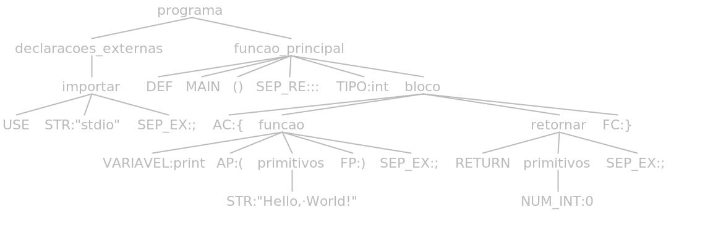

# <p style="text-align:center"><br><br> Departamento de Ciência da Computação<br><br>GCC130 - Compiladores - 2022/2<br><br>Prof. Dr. Mauricio Ronny De Almeida Souza<br><br>

<p style="text-align:center"><br>Henrique Curi de Miranda - 202020087
<br>
<br>João Gabriel Kondarzewski Zanella - 202020091
<br>
<br>Nathan Felipe de Assis - 202020774
<br>
<br>Victor Gonçalves Lima - 202020775

# <p style="text-align:center"><br>Linguagem C Mais ou Menos - **C** **P**lus **M**inus (**CPM**)

# Conteúdo

- [1. Visão Geral](#1-visão-geral)
  - [1.1. hello\_world.cpm](#11-hello_worldcpm)
  - [1.2. plus\_minus.cpm](#12-plus_minuscpm)
  - [1.3. fatorial.cpm](#13-fatorialcpm)
- [2. Definição Léxica](#2-definição-léxica)
- [3. Definição Sintática](#3-definição-sintática)
  - [3.1. Estrutura](#31-estrutura)
  - [3.2. Auxiliares](#32-auxiliares)
  - [3.3. Expressões](#33-expressões)
  - [3.4. Declarações](#34-declarações)
  - [3.5. Repetições](#35-repetições)
  - [3.6. Condicionais](#36-condicionais)
  - [3.7. Chamadas](#37-chamadas)
  - [3.8. Outros](#38-outros)
- [4. Casos de Teste](#4-casos-de-teste)
  - [4.1 hello\_world.cpm](#41-hello_worldcpm)
- [5. Detalhes da Implementação](#5-detalhes-da-implementação)
  - [5.1. Algoritmos de exemplo](#51-algoritmos-de-exemplo)
  - [5.3. Análise Léxica](#53-análise-léxica)
- [6. Repositório no GitHub](#6-repositório-no-github)
- [Ambiente](#ambiente)

# 1. Visão Geral

A linguagem de programação projetada foi nomeada C+- ("C Mais ou Menos"). Seu nome pode ser lido de várias maneiras, como "C Mais ou Menos", "C Plus Minus" ou simplesmente "CPM", igual a extensão de código fonte da linguagem (".cpm"). O C+- é uma linguagem inspirada em C, C++ e Python, apresentando sintax simples, mas fortemente tipada. O objeto da linguagem é ser didática e minimalista, assim, não é orienda a objetos e possui tipos primitivos bem definidos. Abaixo temos alguns exemplos de códigos escritos com a linguagem.

## 1.1. hello_world.cpm

    use "stdio";

    def main() :: int {
        print("Hello, World!");
        return 0;
    };

## 1.2. plus_minus.cpm

    use "stdio";

    def main() :: int {
        int c = 0;
        read(c);
        c+-;
        print(c);
        return 0;
    };

## 1.3. fatorial.cpm

    use "stdio";

    def fatorial(int n) :: int {
        int f = 1;
        while (n > 1) {
            f = f * n;
            n--;
        }
        return f;
    };

    def main() :: int {
        int n = 0;
        read(n);
        n = fatorial(n);
        print(n);
        return 0;
    };

## 1.4. conversor_temeperatura.cpm

    use "stdio";

    def Celsius_para_Fahrenheit(float c) :: float {
        float f = (9.0 * c / 5.0) + 32.0;
        return f;
    };

    def main() :: int {

        float c = 0.0;
        read(c);

        float f = 0;
        f = Celsius_para_Fahrenheit(c);
        print(f);

        return 0;
    };

## 1.5. media_aritmetica.cpm

    use "stdio";

    def media_aritmetica(int a, int b, int c) :: float {
        float media = (a + b + c) / 3.0;
        return media;
    };

    def main() :: int {

        int a = 0, b = 0, c = 0;
        read(a);
        read(b);
        read(c);

        float media = 0.0;
        media = media_aritmetica(a, b, c);
        print(media);

        return 0;
    };

## 1.6. soma_naturais.cpm

    use "stdio";

    def soma_naturais(int n) :: int {
        int soma = 0;
        int i = 1;
        while (i <= n) {
            soma = soma + i;
            i++;
        }
        return soma;
    };

    def main() :: int {
        int n = 0;
        read(n);
        int soma = 0;
        soma = soma_naturais(n);
        print(soma);
        return 0;
    };

## 1.7. distancia_pontos.cpm

    use "stdio";

    def distancia_pontos(float x1, float y1, float x2, float y2) :: float {
        float dx = x2 - x1;
        float dy = y2 - y1;
        float distancia = sqrt(dx*dx + dy*dy);
        return distancia;
    };

    def main() :: int {
        float x1 = 0, y1 = 0, x2 = 0, y2 = 0;
        read(x1);
        read(y1);
        read(x2);
        read(y2);

        float distancia = 0.0;
        distancia = distancia_pontos(x1, y1, x2, y2);
        print(distancia);

        return 0;
    };

## 1.8. maximo.cpm

    use "stdio";

    def maximo(int a, int b) :: int {
        if (a > b) {
            return a;
        } else {
            return b;
        }
    };

    def main() :: int {
        int a = 0, b = 0;
        read(a);
        read(b);

        int max = 0;
        max = maximo(a, b);
        print(max);

        return 0;
    };

## 1.9. ordena_numeros.cpm

    use "stdio";

    def ordena_numeros(int a, int b, int c) :: (int, int, int) {
        if (a > b) {
            int temp = a;
            a = b;
            b = temp;
        }
        if (a > c) {
            int temp = a;
            a = c;
            c = temp;
        }
        if (b > c) {
            int temp = b;
            b = c;
            c = temp;
        }
        return (a, b, c);
    };

    def main() :: int {
        int a = 0, b = 0, c = 0;
        read(a);
        read(b);
        read(c);

        (a, b, c) = ordena_numeros(a, b, c);
        print(a);
        print(b);
        print(c);

        return 0;
    };

## 1.10. area_circulo.cpm

    use "stdio";

    def area_circulo(float raio) :: float {
        float area = 3.14159 * raio * raio;
        return area;
    };

    def main() :: int {
        float raio = 0.0;
        read(raio);

        float area = 0.0;
        area = area_circulo(raio);
        print(area);

        return 0;

# 2. Definição Léxica

A tabela abaixo apresenta uma lista completa dos elementos que compõem a definição léxica da linguagem C+-, incluindo estruturas de controle, operadores aritméticos, relacionais e lógicos, tipos primitivos, delimitadores e identificadores de variáveis e funções. A tabela também inclui especificações para comentários, definição da função principal, definição de funções, retorno de valor por função, estruturas condicionais e de repetição, separadores de tipo da função e linha de expressão, atribuição de valor à variável, incrementadores e decrementadores, números inteiros e reais, e cadeias de caracteres. Esses padrões de uso fornecem as regras fundamentais para que um programa seja escrito em C+-.

Classe | Sigla | Padrão
-------|-------|-------
Comentário | COMMENT | Cadeia de caracteres iniciadas com "/*" e terminadas com "*/"
Tipos primitivos | TIPO | "int", "float", "void", "double", "str" |
Identificação da função principal | MAIN | "main"
Definir funções | DEF | "def"
Retorno de valor por função | RETURN | "return"
Estrutura condicional "se" | IF | "if"
Estrutura condicional "se não se" | IFSE | "ifse"
Estrutura condicional "se não" | ELSE | "else"
Estrutura de repetição "enquanto" | WHILE | "while"
Estrutura de repetição "para" | FOR | "for"
Separador de tipo da função | SEP_RE: "::"
Separador de linha de expressão | SEP_EX | ";"
Abre chave | AC | "{"
Fecha chave | FC | "}"
Abre parêntese | AP | "("
Fecha parêntese | FP | ")"
Abre colchete | ACOL | "["
Fecha colchete | FCOL | "]"
Identificador de variáveis e funções | ID | Cadeia de caracteres incluindo dígitos, letras maiúsculas, letras minúsculas e sublinhado, devendo começar com sublinhado ou letra minúscula.
Atribuiçao de valor à variável | ATR | "="
Incrementador de mais menos | MAISMENOS | "+-"
Incrementador | MAISMAIS | "++"
Decrementador | MENOSMENOS | "--"
Operadores aritméticos | OP_ARIT | "+" ou "-" ou "*" ou "/" ou "%"
Operadores relacionais | OP_REL | "<" ou ">" ou "<=" ou ">=" ou "==" ou "!="
Operadores lógicos | OP_LOG | "and" ou "or" ou "not"
Números inteiros | NUM_INT | Sequência de dígitos que, opcionalmente, iniciar ou com um símbolo negativo ou um símbolo positivo
Números reais | NUM_FLOAT | Sequência de dígitos que, opcionalmente, iniciar ou com um símbolo negativo ou um símbolo positivo seguidas de um ponto e outra sequência de dígitos
Cadeias de caracteres (strings) | STR | Cadeia de caracteres delimitados por aspas duplas

# 3. Definição Sintática

## 3.1. Estrutura

- programa

        global funcao_principal?

- funcao_principal:

        DEF MAIN '()' '::' TIPO bloco

- global

        (
        bloco
        | expressao ';'
        | declaracao
        | repeticao
        | condicional
        | chamada ';'
        | importar ';'
        | retornar ';'
        )*

- bloco

       '{'
        (
        bloco
        | vetor
        | funcao
        | expressao ';'
        | declaracao
        | repeticao
        | condicional
        | chamada ';'
        | importar ';'
        | retornar ';'
        )*
        '}'

## 3.2. Auxiliares

- tipos_primitivos

        NUM_FLOAT | NUM_INT | STR | ID | BOOL | funcao | vetor

- tipos_atribuicao

        | expressao

- parametro

        ((tipos_primitivos | expressao) (',' (tipos_primitivos | expressao))*)

- indice

        (NUM_INT | ID | vetor | funcao | expressao)

- termo_aritmetico

        fator_aritmetico (OP_ARIT fator_aritmetico)*

- fator_aritmetico

        tipos_primitivos | '(' expressao_aritmetica ')'

- termo_logico

        fator_logico (OP_LOG fator_logico)*

- fator_logico

        ID | vetor | BOOL | '(' expressao_logica ')'

- termo_relacional

        fator_relacional (OP_REL fator_relacional)*

- fator_relacional

        tipos_primitivos  | BOOL | '(' expressao_relacional ')'

## 3.3. Expressões

- expressao

        expressao_aritmetica
        | expressao_logica
        | expressao_relacional

- expressao_aritmetica

        termo_aritmetico ((OP_ARIT (termo_aritmetico | termo_relacional)) | MENOSMENOS | MAISMAIS | MAISMENOS)*

- expressao_logica

        termo_logico (OP_LOG (termo_logico | termo_relacional))*

- expressao_relacional

        termo_relacional (OP_REL (termo_relacional | termo_logico))*

## 3.4. Declarações

- declaracao

        declaracao_variavel ';'
        | declaracao_vetor
        | declaracao_funcao

- declaracao_variavel

        TIPO ID ('=' tipos_atribuicao)?

- declaracao_vetor

        TIPO '[' (NUM_INT | ID | vetor) ']'

- declaracao_funcao

        DEF ID '(' (TIPO ID (',' TIPO ID)*) ')' '::' TIPO  bloco |
        DEF ID '()' '::' TIPO  bloco  // Gambiarra

## 3.5. Repetições

- repeticao

        repeticao_while
        | repeticao_for

- repeticao_while

        WHILE expressao bloco

- repeticao_for

        FOR '(' declaracao_variavel ';' expressao ';' (ID (MAISMAIS | MAISMENOS | MENOSMENOS)) ')' bloco

## 3.6. Condicionais

- condicional

        condicional_if
        | condcional_ifse
        | condicional_else

- condicional_if

        IF expressao bloco

- condcional_ifse

        IFSE expressao bloco

- condicional_else

        ELSE bloco

## 3.7. Chamadas

- chamada

        chamada_funcao
        | chamada_atribuicao

- chamada_funcao

        ID '(' (tipos_atribuicao | /*vazio*/) ')'

- chamada_atribuicao

        (ID | vetor) '=' tipos_atribuicao

## 3.8. Outros

- importar

        USE STR

- vetor

        ID '[' indice ']'

- funcao

        ID '(' parametro ')'

- retornar

        RETURN tipos_atribuicao

# 4. Casos de Teste

## 4.1 hello_world.cpm

- Sem erro

        use "stdio";

        def main() :: int {
            print("Hello, World!");
            return 0;
        }

    O código sem nenhum erro gera a seguinte saída de tokens:

        Lexema: use
            Classe: 'use'
            Linha: 1
        Lexema: "stdio"
            Classe: STR
            Linha: 1
        Lexema: ;
            Classe: ';'
            Linha: 1
        Lexema: def
            Classe: 'def'
            Linha: 3
        Lexema: main
            Classe: 'main'
            Linha: 3
        Lexema: (
            Classe: '('
            Linha: 3
        Lexema: )
            Classe: ')'
            Linha: 3
        Lexema: ::
            Classe: '::'
            Linha: 3
        Lexema: int
            Classe: TIPO
            Linha: 3
        Lexema: {
            Classe: '{'
            Linha: 3
        Lexema: print
            Classe: ID
            Linha: 5
        Lexema: (
            Classe: '('
            Linha: 5
        Lexema: "Hello, World!"
            Classe: STR
            Linha: 5
        Lexema: )
            Classe: ')'
            Linha: 5
        Lexema: ;
            Classe: ';'
            Linha: 5
        Lexema: return
            Classe: 'return'
            Linha: 7
        Lexema: 0
            Classe: NUM_INT
            Linha: 7
        Lexema: ;
            Classe: ';'
            Linha: 7
        Lexema: }
            Classe: '}'
            Linha: 8
        Lexema: <EOF>
            Classe: EOF
            Linha: 9

    Gera a seguinte árvore sintática:

    

- Com erro

    Um erro sintático em `returm` ao invés de `return` e um erro léxico com a presença de um lexema não identificável “~”)

        use "stdio";

        def main() :: int {
            print(~"Hello, World!");
            returm 0;
        }

    Gera a seguinte saída de tokens:

        Lexema: use
            Classe: 'use'
            Linha:  1
        Lexema: "stdio"
            Classe: STR
            Linha:  1
        Lexema: ;
            Classe: ';'
            Linha:  1
        Lexema: def
            Classe: 'def'
            Linha:  3
        Lexema: main
            Classe: 'main'
            Linha:  3
        Lexema: ()
            Classe: '()'
            Linha:  3
        Lexema: ::
            Classe: '::'
            Linha:  3
        Lexema: int
            Classe: TIPO
            Linha:  3
        Lexema: {
            Classe: '{'
            Linha:  3
        Lexema: print
            Classe: VARIAVEL
            Linha:  4
        Lexema: (
            Classe: '('
            Linha:  4

        ==========================================
        Lexema invalido identificado!
            Lexema: ~
            Linha:  4
            Inicio: 44
            Fim:    44
        ==========================================

        Lexema: "Hello, World!"
            Classe: STR
            Linha:  4
        Lexema: )
            Classe: ')'
            Linha:  4
        Lexema: ;
            Classe: ';'
            Linha:  4
        Lexema: returm
            Classe: VARIAVEL
            Linha:  5
        Lexema: 0
            Classe: NUM_INT
            Linha:  5
        Lexema: ;
            Classe: ';'
            Linha:  5
        Lexema: }
            Classe: '}'
            Linha:  6

    Gera a seguinte árvore sintática:

    

# 5. Detalhes da Implementação

A equipe gerou os algoritmos de exemplo (arquivos do diretório “codigos”), “cpm.g4”,
“testarLexer.java”, “README.md” e “.gitignore”. O restante dos arquivos foi gerado utilizando o
ANTLR.

## 5.1. Algoritmos de exemplo

Foram gerados cinco códigos de exemplo para o analisador léxico. Todos são individuais e
demonstram alguma característica diferente dos outros.

- hello_wordl.cpm

        use "stdio";

        def main() :: int {

            print("Hello, World!");

            return 0;
        }

- plus_minus.cpm

        use "stdio";

        def main() :: int {
            int c = 0;
            read(c);
            c+-;
            print(c);
            return 0;
        }

- arranjo.cpm

        use "stdio"

        def main() :: int {

            int n = 0;
            read(n);

            int[n] arranjo;

            for (int i = 0; i < n; i++) {
                read(arranjo[i]);
            }

            for (int i = 0; i < n; i++) {
                print(arranjo[i]);
                print(" ");
            }

            return 0;
        }

- conversor_temperatura.cpm

        use "stdio"

        def Celsius_para_Fahrenheit(float c) :: float {
            float f = (9.0 * c / 5.0) + 32.0;
            return f;
        }

        def main() :: int {

            float c = 0.0;
            read(c);

            float f = 0;
            f = Celsius_para_Fahrenheit(c);
            print(f);

            return 0;
        }

- fatorial.cpm

        use "stdio";

        def fatorial(int n) :: int {
            int f = 1;
            while (n > 1) {
                f = f * n;
                n--;
            }
            return f;
        }

        def main() :: int {
            int n = 0;
            read(n);
            n = fatorial(n);
            print(n);
            return 0;
        }

5.2. Gerador de Gramática

O código abaixo foi usado para gerar os tokens dos algoritmos de exemplo. Nele estão definidos as classes e suas expressões regulares.

    grammar cpm;

    /*
    -------------------------------------------- LEXER RULES ------------------------------------------------
    ----------------------------------------------------------------------------------------------------------
    ----------------------------------------------------------------------------------------------------------
    ----------------------------------------------------------------------------------------------------------
    ----------------------------------------------------------------------------------------------------------
    ----------------------------------------------------------------------------------------------------------
    */

    fragment LETRA: [a-zA-Z];
    fragment DIGITO: [0-9];

    // Incluir bibliotecas
    USE: 'use' ;

    // Comentário
    COMMENT: '/*' .* '*/' ;

    // Tipos primitivos
    TIPO: 'int' | 'float' | 'void' | 'double' | 'str' | 'bool';

    // Booleanos
    BOOL: 'true' | 'false' ;

    // Definir funções
    DEF: 'def' ;

    // Função principal
    MAIN: 'main' ;

    // Retorno de valor por função
    RETURN: 'return' ;

    // Estruturas condicionais
    IF: 'if' ;
    IFSE: 'ifse' ;
    ELSE: 'else' ;

    // Estruturas de repetição
    WHILE: 'while' ;
    FOR: 'for' ;

    // Separadores
    SEP_RE: '::' ;
    SEP_EX: ';' ;

    // Delimitadores
    AC: '{' ;
    FC: '}' ;
    AP: '(' ;
    FP: ')' ;
    ACOL : '[' ;
    FCOL : ']' ;

    // Operadores lógicos
    OP_LOG: 'and' | 'or' | 'not' ;

    // Atribuição
    ATR: '=' ;

    // Operadores aritméticos
    MAISMENOS: '+-' ;
    MAISMAIS: '++' ;
    MENOSMENOS: '--' ;
    OP_ARIT: '+' | '-' | '*' | '/' | '%' ;

    // Operadores relacionais
    OP_REL: '<' | '<=' | '>=' | '>' | '==' | '!=' ;

    // Números
    NUM_INT: ('-' | '+')?DIGITO+ ;
    NUM_FLOAT: ('-' | '+')?DIGITO+('.'DIGITO+) ;

    // Strings
    STR: '"' ('\\' ["\\] | ~["\\\r\n])* '"' ;

    // Nome de variáveis e funções
    ID: (LETRA | '_')(DIGITO | LETRA | '_')* ;

    // Caracteres inúteis
    WS: [ \r\t\n]* -> skip ;

    // Erro
    ERROR: . ;

    /*
    -------------------------------------------- PARSER RULES -----------------------------------------------
    ----------------------------------------------------------------------------------------------------------
    ----------------------------------------------------------------------------------------------------------
    ----------------------------------------------------------------------------------------------------------
    ----------------------------------------------------------------------------------------------------------
    ----------------------------------------------------------------------------------------------------------
    */

    /*
    -------------------------------------------- Estrutura --------------------------------------------------
    ----------------------------------------------------------------------------------------------------------
    */

    // Estrutura padrão de um programa cpm
    programa:
        global funcao_principal?
        ;

    funcao_principal:
        DEF MAIN '()' '::' TIPO bloco
        ;

    global:
        (
        bloco
        | expressao ';'
        | declaracao
        | repeticao
        | condicional
        | chamada ';'
        | importar ';'
        | retornar ';'
        )*
        ;

    // Um bloco é tudo aquilo em que é necessário {}
    bloco:
    '{'
    (
        bloco
        | vetor
        | funcao
        | expressao ';'
        | declaracao
        | repeticao
        | condicional
        | chamada ';'
        | importar ';'
        | retornar ';'
    )*
    '}'
    ;


    /*
    -------------------------------------------- Auxiliares -------------------------------------------------
    ----------------------------------------------------------------------------------------------------------
    */

    // Necessário para não causar recursão à esquerda nas expressões
    // Mudar nome
    tipos_primitivos:
        NUM_FLOAT | NUM_INT | STR | ID | BOOL | funcao | vetor
        ;

    tipos_atribuicao:
        tipos_primitivos
        | expressao
        ;

    parametro:
        ((tipos_primitivos | expressao) (',' (tipos_primitivos | expressao))*)
        ;

    indice:
        (NUM_INT | ID | vetor | funcao | expressao)
        ;

    termo_aritmetico:
        fator_aritmetico (OP_ARIT fator_aritmetico)*
        ;

    fator_aritmetico:
        tipos_primitivos | '(' expressao_aritmetica ')'
        ;

    termo_logico:
        fator_logico (OP_LOG fator_logico)*
        ;

    fator_logico:
        ID | vetor | BOOL | '(' expressao_logica ')'
        ;

    termo_relacional:
        fator_relacional (OP_REL fator_relacional)*
        ;

    fator_relacional:
        tipos_primitivos  | BOOL | '(' expressao_relacional ')'
        ;

    /*
    -------------------------------------------- Expressões -------------------------------------------------
    ----------------------------------------------------------------------------------------------------------
    */

    expressao:
        expressao_aritmetica
        | expressao_logica
        | expressao_relacional
        ;

    expressao_aritmetica:
        termo_aritmetico ((OP_ARIT (termo_aritmetico | termo_relacional)) | MENOSMENOS | MAISMAIS | MAISMENOS)*
        ;

    expressao_logica:
        termo_logico (OP_LOG (termo_logico | termo_relacional))*
        ;

    expressao_relacional:
        termo_relacional (OP_REL (termo_relacional | termo_logico))*
        ;

    /*
    -------------------------------------------- Declarações ------------------------------------------------
    ----------------------------------------------------------------------------------------------------------
    */

    declaracao:
        declaracao_variavel ';'
        | declaracao_vetor
        | declaracao_funcao
        ;

    declaracao_variavel:
        TIPO ID ('=' tipos_atribuicao)?
        ;

    declaracao_vetor:
        TIPO '[' (NUM_INT | ID | vetor) ']'
        ;

    declaracao_funcao:
        DEF ID '(' (TIPO ID (',' TIPO ID)*) ')' '::' TIPO  bloco |
        DEF ID '()' '::' TIPO  bloco  // Gambiarra
        ;

    /*
    -------------------------------------------- Repetições -------------------------------------------------
    ----------------------------------------------------------------------------------------------------------
    */

    repeticao:
        repeticao_while
        | repeticao_for
        ;

    repeticao_while:
        WHILE expressao bloco
        ;

    repeticao_for:
        FOR '(' declaracao_variavel ';' expressao ';' (ID (MAISMAIS | MAISMENOS | MENOSMENOS)) ')' bloco
        ;

    /*
    -------------------------------------------- Condicionais -----------------------------------------------
    ----------------------------------------------------------------------------------------------------------
    */

    condicional:
        condicional_if
        | condcional_ifse
        | condicional_else
        ;

    condicional_if:
        IF expressao bloco
        ;

    condcional_ifse:
        IFSE expressao bloco
        ;

    condicional_else:
        ELSE bloco
        ;

    /*
    -------------------------------------------- Chamadas ---------------------------------------------------
    ----------------------------------------------------------------------------------------------------------
    */

    chamada:
        chamada_funcao
        | chamada_atribuicao
        ;

    chamada_funcao:
        ID '(' (tipos_atribuicao | /*vazio*/) ')'
        ;

    chamada_atribuicao:
        (ID | vetor) '=' tipos_atribuicao
        ;

    /*
    -------------------------------------------- Outros -----------------------------------------------------
    ----------------------------------------------------------------------------------------------------------
    */

    importar:
        USE STR
        ;

    vetor:
        ID '[' indice ']'
        ;

    funcao:
        ID '(' parametro ')'
        ;

    retornar:
        RETURN tipos_atribuicao
        ;

## 5.3. Análise Léxica

O código abaixo foi usado para imprimir o resultado da análise léxica dos algoritmos de exemplo. Nele estão sendo impressos os lexemas, juntamente com sua classe e linha que está presente. Também, em caso de lexema inválido, é chamada a função para imprimir uma mensagem de erro informando qual o lexema não identificado, a linha e os índices de início e fim do mesmo. Para ler um algoritmo de exemplo e fazer a análise léxica, é feita uma leitura do nome do arquivo desejável.

    import org.antlr.v4.runtime.CharStream;
    import org.antlr.v4.runtime.CharStreams;
    import org.antlr.v4.runtime.Token;

    import java.io.IOException;
    import java.util.Scanner;

    public class testarLexer {

        private static Scanner scanner = new Scanner(System.in);

        public static void imprimir_lexema(cpmLexer lexer, Token token) {
            System.out.println("Lexema: " + token.getText());
            System.out.println("    Classe: " + lexer.getVocabulary().getDisplayName(token.getType()));
            System.out.println("    Linha:  " + token.getLine());
        }

        public static void imprimir_erro(Token token) {
            System.out.println("\n==========================================");
            System.out.println("Lexema invalido identificado!");
            System.out.println("    Lexema: " + token.getText());
            System.out.println("    Linha:  " + token.getLine());
            System.out.println("    Inicio: " + token.getStartIndex());
            System.out.println("    Fim:    " + token.getStopIndex());
            System.out.println("==========================================\n");
        }

        public static void  main (String[] args){
            System.out.print("Entre o código fonte: ");
            String filename = "./codigos/" + scanner.nextLine();
            try {
                CharStream input = CharStreams.fromFileName(filename);
                cpmLexer lexer = new cpmLexer(input);
                Token token;
                while (!lexer._hitEOF) {
                    token = lexer.nextToken();

                    if (lexer.getVocabulary().getDisplayName(token.getType()).equals("ERROR")) {
                        imprimir_erro(token);
                    }
                    else {
                        imprimir_lexema(lexer, token);
                    }
                }

            }
            catch (IOException e) {
                e.printStackTrace();
            }
        }
    }

# 6. Repositório no GitHub

A implementação do analisador léxico está disponível em: https://github.com/jgkzanella/analisador-lexico-cpm.

# Ambiente

- Toda a implementação foi desenvolvida e testada em sistema Linux utilizando JDK.

      sudo apt install default-jdk

- Para gerar o analisador léxico e o parser:

      java -jar ./antlr-4.11.1-complete.jar ./src/cpm.g4

- Os códigos fontes da linguagem CPM devem estar no diretório ```./codigos/``` para teste.

- Testando o lexer:

  - Compilar e executar `./src/testarLexer.java` utilizando a dependência `antlr-4.11.1-complete.jar`.

  - Digitar o nome de um arquivo de código fonte da pasta `./codigos/`. Exemplo: `hello_world.cpm`
